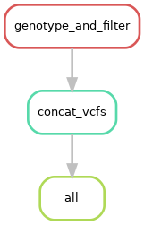
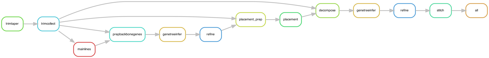

We added another rule `concat_vcfs` which concatenates the VCF files for 22 chromosomes into a single VCF.

Using `expand`, we can make the input and output a *list* of files. Here, `CHR` must be a python iterable object.

Now, the `all` rule designates `sample1/calls.vcf.gz`. 

Dry run: 

`snakemake -c1 -np all`

You can visualize the execution "directed acyclic graph (DAG)" using the following command:

`snakemake --rulegraph all -c 1 | dot -Tpng > rulegraph.png`

It created the following plot

This example is simple, but it is a useful command for visualizing complex workflows. For example, uDance:

Execute:

`snakemake -c 22 all`

